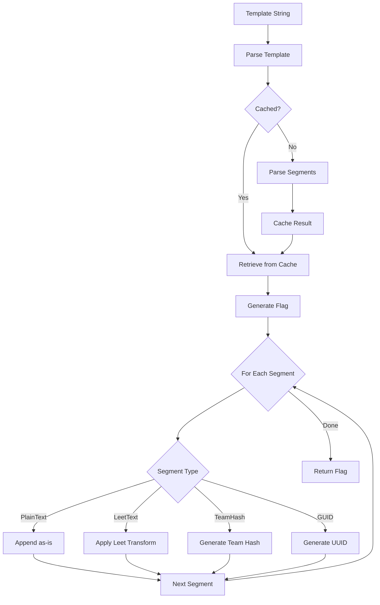
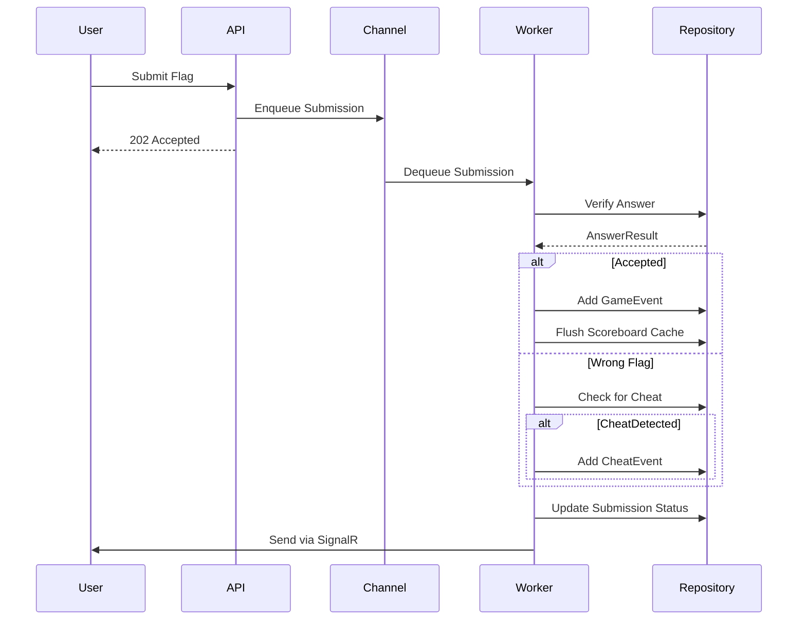

GZCTF implements a sophisticated dynamic flag generation system that creates unique flags for each team. This prevents flag sharing between teams while maintaining compatibility with standard CTF challenge containers.

## Flag Generation Architecture

The flag system consists of three main components:

1. **Template Parser** - Parses flag templates into executable segments
2. **Flag Generator** - Generates flags based on parsed templates
3. **Flag Checker** - Validates submitted flags against expected values

## Flag Templates

Flag templates define how dynamic flags are generated. GZCTF supports multiple template syntaxes:

<CardGroup cols={2}>
  <Card title="GUID Templates" icon="fingerprint">
    ```
    flag{[GUID]}
    ```
    Generates a random UUID v4 for each flag
  </Card>
  
  <Card title="Team Hash Templates" icon="hashtag">
    ```
    flag{[TEAM_HASH]_suffix}
    ```
    Generates a deterministic hash based on team token
  </Card>
  
  <Card title="Leet Templates" icon="wand-magic-sparkles">
    ```
    flag{Hello_World_123}
    ```
    Applies leet speak transformations to braced content
  </Card>
  
  <Card title="Complex Leet Templates" icon="shield-halved">
    ```
    [CLEET]flag{Secure_Flag}
    ```
    Applies complex leet with special characters
  </Card>
</CardGroup>

## Template Syntax

### Placeholder Types

<AccordionGroup>
  <Accordion title="[GUID] Placeholder" icon="fingerprint">
    Replaced with a random UUID v4 in standard format:
    
    ```
    flag{[GUID]}
    → flag{3c8e9d2a-4f1b-4a6c-9e2d-7f8a9b3c1d4e}
    ```
    
    **Properties**:
    - Generates 36-character UUID
    - Cryptographically random
    - Unique per flag generation
    - **Bypasses entropy checking**
    
    Reference: `/src/GZCTF/Utils/FlagGenerator.cs:331-340`
  </Accordion>

  <Accordion title="[TEAM_HASH] Placeholder" icon="hashtag">
    Replaced with a 12-character deterministic hash:
    
    ```
    flag{user_[TEAM_HASH]}
    → flag{user_a3f9c8e2b1d4}
    ```
    
    **Hash Calculation**:
    ```csharp
    var salt = SHA256($"{game.TeamHashSalt}::{challengeId}");
    var hash = SHA256($"{salt}::{participation.Token}");
    return hash.Substring(12, 12);  // Characters 12-24
    ```
    
    **Properties**:
    - Deterministic per team+challenge
    - Same team always gets same hash for same challenge
    - **Bypasses entropy checking**
    - Enables flag regeneration
    
    Reference: `/src/GZCTF/Models/Data/Challenge.cs:116-128`
  </Accordion>

  <Accordion title="Leet Transformation" icon="wand-magic-sparkles">
    Content inside braces `{...}` is randomly transformed:
    
    ```
    flag{Hello World}
    → flag{H3ll0_W0r1d}  (random variation)
    → flag{He110_WorId}  (different variation)
    ```
    
    **Character Mappings**:
    ```
    A → Aa4
    E → Ee3  
    I → Ii1l
    O → Oo0
    S → Ss5
    T → Tt7
    (space) → _
    ```
    
    Full character map in `/src/GZCTF/Utils/FlagGenerator.cs:159-197`
  </Accordion>

  <Accordion title="Complex Leet ([CLEET])" icon="shield-halved">
    Prefix template with `[CLEET]` for enhanced character mappings:
    
    ```
    [CLEET]flag{Secure}
    → flag{S3cur3}   (standard)
    → flag{$3cu®3}   (complex with special chars)
    ```
    
    **Additional Mappings**:
    ```
    A → Aa4@
    I → Ii1l!
    O → Oo0#
    S → Ss5$
    ```
    
    Reference: `/src/GZCTF/Utils/FlagGenerator.cs:199-237`
  </Accordion>
</AccordionGroup>

### Leet Modes

The flag generator operates in four leet modes:

```csharp Leet Modes
public enum LeetMode
{
    None = 0,      // GUID or TEAM_HASH present - no leet
    Default = 1,   // Auto-leet without marker
    Leet = 2,      // [LEET] marker - basic leet
    CLeet = 3      // [CLEET] marker - complex leet
}
```

**Mode Selection Logic**:
1. If template starts with `[LEET]` → `Leet` mode
2. If template starts with `[CLEET]` → `CLeet` mode  
3. If template contains `[GUID]` or `[TEAM_HASH]` → `None` mode
4. Otherwise → `Default` mode

Reference: `/src/GZCTF/Utils/FlagGenerator.cs:55-76`

## Template Parsing

### Segment-Based Parsing

Templates are parsed into ordered segments for efficient generation:

```csharp Flag Segments
public enum FlagSegmentType
{
    PlainText,    // No transformation
    LeetText,     // Apply leet transformation  
    TeamHash,     // [TEAM_HASH] placeholder
    Guid          // [GUID] placeholder
}

public record FlagSegment
{
    public FlagSegmentType Type { get; init; }
    public Range? ContentRange { get; init; }  // Range in original template
}
```

### Parsing Example

Template: `flag{[TEAM_HASH]_admin_{data}}`

Parsed segments:
1. `PlainText`: `flag{`
2. `TeamHash`: (placeholder)
3. `PlainText`: `_admin_`
4. `LeetText`: `{data}` 
5. `PlainText`: `}`

Reference: `/src/GZCTF/Utils/FlagGenerator.cs:314-384`

### LRU Template Cache

Parsed templates are cached to avoid re-parsing:

```csharp
private static readonly FlagTemplateCache Cache = new(capacity: 64);
```

Cache uses least-recently-used (LRU) eviction and is thread-safe via lock.

Reference: `/src/GZCTF/Utils/FlagGenerator.cs:10-50`

## Flag Generation

### Generation Flow



### Core Generation Logic

```csharp Flag Generation
public string GenerateWithTeamHash(Func<string> teamHashProvider)
{
    var builder = new StringBuilder(template.EstimatedLength);
    var applyLeet = template.LeetMode is not LeetMode.None;
    var map = template.LeetMode is LeetMode.CLeet 
        ? ComplexCharMap 
        : CharMap;
    
    foreach (var segment in template.Segments)
    {
        switch (segment.Type)
        {
            case FlagSegmentType.PlainText:
                builder.Append(template.Template[segment.ContentRange]);
                break;
                
            case FlagSegmentType.LeetText:
                var content = template.Template[segment.ContentRange];
                if (applyLeet)
                    LeetSpan(content, builder, map);
                else
                    builder.Append(content);
                break;
                
            case FlagSegmentType.TeamHash:
                builder.Append(teamHashProvider());
                break;
                
            case FlagSegmentType.Guid:
                builder.Append(Guid.NewGuid().ToString("D"));
                break;
        }
    }
    
    return builder.ToString();
}
```

Reference: `/src/GZCTF/Utils/FlagGenerator.cs:407-447`

### Leet Transformation

```csharp Leet Character Mapping
private static void LeetSpan(
    ReadOnlySpan<char> segment, 
    StringBuilder builder,
    Dictionary<char, string> map)
{
    foreach (var c in segment)
    {
        if (map.TryGetValue(char.ToUpperInvariant(c), out var table))
        {
            // Randomly select from available character variants
            var nc = table[Random.Next(table.Length)];
            builder.Append(nc);
        }
        else
        {
            // Replace spaces with underscores, keep other chars
            builder.Append(c is ' ' ? '_' : c);
        }
    }
}
```

Reference: `/src/GZCTF/Utils/FlagGenerator.cs:449-467`

## Entropy Validation

### Minimum Entropy Requirements

Flags without `[GUID]` or `[TEAM_HASH]` must meet minimum entropy requirements:

```csharp Entropy Calculation
public double CalculateEntropy()
{
    var entropy = 0.0;
    var map = leetMode is LeetMode.CLeet 
        ? ComplexCharMap 
        : CharMap;
    
    foreach (var segment in template.Segments)
    {
        if (segment.Type is FlagSegmentType.LeetText)
        {
            foreach (var c in template[segment.ContentRange])
            {
                if (map.TryGetValue(char.ToUpperInvariant(c), out var table))
                {
                    // Add log2(variants) to total entropy
                    entropy += Math.Log(table.Length, 2);
                }
            }
        }
    }
    
    return entropy;
}
```

**Default Minimum**: 32 bits of entropy

**Examples**:
- `flag{Hello}` - ~10 bits (REJECTED)
- `flag{HelloWorldCTF2024}` - ~45 bits (ACCEPTED)
- `flag{[GUID]}` - Infinite (ACCEPTED - bypass)

Reference: `/src/GZCTF/Utils/FlagGenerator.cs:469-494`

### Validation Logic

```csharp
public bool IsValid(double minEntropy = 32.0)
{
    if (string.IsNullOrWhiteSpace(template))
        return false;
    
    // Templates with GUID or TEAM_HASH have sufficient randomness
    if (template.HasSufficientRandomness)
        return true;
    
    // Check if estimated length exceeds database limit
    if (template.EstimatedLength > Limits.MaxFlagLength)
        return false;
    
    // Otherwise, check if Leet entropy meets minimum
    return template.LeetMode is not LeetMode.None 
        && CalculateEntropy() >= minEntropy;
}
```

Reference: `/src/GZCTF/Utils/FlagGenerator.cs:496-516`

## Flag Checker Service

The FlagChecker is a background service that processes flag submissions:

### Architecture

```csharp
public class FlagChecker(
    ChannelReader<Submission> channelReader,
    ChannelWriter<Submission> channelWriter,
    IServiceScopeFactory serviceScopeFactory
) : IHostedService
```

**Worker Count**: Dynamically scaled based on system resources
- < 2GB RAM or ≤ 3 CPUs → 1 worker
- < 4GB RAM or ≤ 6 CPUs → 2 workers
- Otherwise → 4 workers

Reference: `/src/GZCTF/Services/FlagChecker.cs:54-68`

### Submission Processing



### Answer Verification

```csharp Instance Verification
public async Task<(SubmissionType, AnswerResult)> VerifyAnswer(
    Submission submission, 
    CancellationToken token)
{
    var instance = await GetInstanceBySubmission(submission, token);
    
    if (instance is null)
        return (SubmissionType.Unaccepted, AnswerResult.NotFound);
    
    // Compare submitted flag with instance flag
    if (instance.Flag == submission.Answer)
        return (SubmissionType.Normal, AnswerResult.Accepted);
    
    return (SubmissionType.Normal, AnswerResult.WrongAnswer);
}
```

Reference: `/src/GZCTF/Services/FlagChecker.cs:97-175`

## Environment Variable Injection

<Warning>
Flag injection is a **protected component** under the Restricted License.

The `GZCTF_FLAG` environment variable must be preserved in container creation code. Unauthorized removal or modification may violate license terms.
</Warning>

### Docker Injection

```csharp
Env = config.Flag is null
    ? [$"GZCTF_TEAM_ID={config.TeamId}"]
    : [
        $"GZCTF_FLAG={config.Flag}",
        $"GZCTF_TEAM_ID={config.TeamId}"
      ]
```

Reference: `/src/GZCTF/Services/Container/Manager/DockerManager.cs:285-287`

### Kubernetes Injection

```csharp
IList<V1EnvVar> envs = config.Flag is null
    ? [new V1EnvVar { Name = "GZCTF_TEAM_ID", Value = config.TeamId }]
    : [
        new V1EnvVar { Name = "GZCTF_FLAG", Value = config.Flag },
        new V1EnvVar { Name = "GZCTF_TEAM_ID", Value = config.TeamId }
      ];
```

Reference: `/src/GZCTF/Services/Container/Manager/KubernetesManager.cs:64-70`

## Template Best Practices

<CardGroup cols={2}>
  <Card title="High Entropy Templates" icon="check">
    ```
    flag{[GUID]}
    flag{user_[TEAM_HASH]}
    flag{LongRandomStringWithNumbers123456}
    ```
  </Card>
  
  <Card title="Low Entropy Templates" icon="xmark">
    ```
    flag{hi}
    flag{CTF}
    flag{easy}
    ```
  </Card>
</CardGroup>

### Recommendations

1. **Use GUID or TEAM_HASH** for maximum uniqueness
2. **Leet templates should be 12+ characters** for adequate entropy
3. **Include numbers and mixed case** to increase character variants
4. **Avoid short words** that don't provide enough entropy
5. **Test templates** using the admin test flag endpoint

## Testing Flags

GZCTF provides test flag generation for admins:

```typescript Test Flag Generation
GET /api/admin/game/{gameId}/challenge/{challengeId}/testflag

Response:
{
  "flag": "flag{TestTeamHash_4d8f9c2a-1e3b-4f7c-9a2e-8d6f3b1c5a7e}"
}
```

Test flags always use:
- `"TestTeamHash"` for `[TEAM_HASH]` placeholders
- Random GUID for `[GUID]` placeholders
- Random leet transformations

Reference: `/src/GZCTF/Models/Data/Challenge.cs:145-154`

## Next Steps

<CardGroup cols={2}>
  <Card title="Container Providers" icon="server" href="./container-providers">
    Learn how flags are injected into challenge containers
  </Card>
  <Card title="Traffic Capture" icon="network-wired" href="./traffic-capture">
    Monitor network traffic to detect flag extraction
  </Card>
</CardGroup>