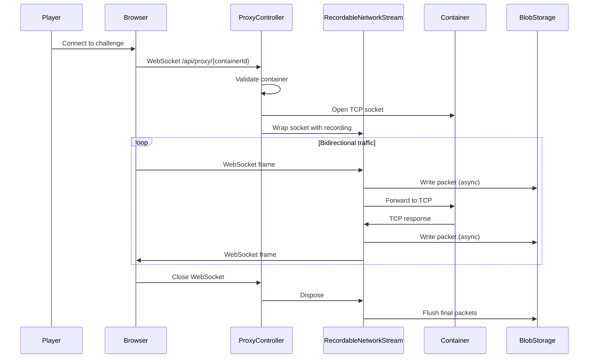

GZCTF provides advanced traffic monitoring capabilities through its platform proxy system. This allows you to capture and analyze network traffic between participants and challenge containers, useful for debugging, monitoring, and post-competition analysis.

## Architecture Overview

The traffic capture system consists of three main components:

1. **ProxyController** - WebSocket proxy endpoint that bridges TCP connections
2. **RecordableNetworkStream** - Wrapper that captures traffic to storage
3. **PCAP Writer** - Generates standard PCAP files for analysis tools



## Platform Proxy Mode

### Configuration

Enable platform proxy in `appsettings.json`:

```json
{
  "ContainerProvider": {
    "PortMappingType": "PlatformProxy",
    "EnableTrafficCapture": true,
    "PublicEntry": "ctf.example.com"
  }
}
```

<Note>
**PortMappingType** options:
- `Default` - Direct port mapping (Docker) or NodePort (K8s)
- `PlatformProxy` - WebSocket proxy through GZCTF
- `Randomize` - Direct mapping with randomized ports
</Note>

Reference: `/src/GZCTF/Controllers/ProxyController.cs:50-53`

### Proxy Endpoints

<AccordionGroup>
  <Accordion title="Standard Proxy (with game instance)" icon="globe">
    ```
    GET /api/proxy/{containerId}
    Upgrade: websocket
    ```
    
    Used for challenge containers associated with game instances. Includes traffic capture if enabled.
    
    **Features**:
    - Connection limiting (max 32 concurrent connections)
    - Traffic capture with metadata
    - Container validation caching
    - Automatic timeout (30 minutes)
    
    Reference: `/src/GZCTF/Controllers/ProxyController.cs:56-116`
  </Accordion>

  <Accordion title="Test Proxy (no instance)" icon="flask">
    ```
    GET /api/proxy/NoInst/{containerId}
    Upgrade: websocket
    ```
    
    Used for admin test containers. No traffic capture.
    
    **Restrictions**:
    - Admin access only
    - No game instance association required
    - No connection limits
    - No traffic recording
    
    Reference: `/src/GZCTF/Controllers/ProxyController.cs:119-163`
  </Accordion>
</AccordionGroup>

## Connection Flow

### Container Validation

Before establishing a proxy connection, the controller validates:

```csharp Container Validation
private async Task<bool> ValidateContainer(Guid id, CancellationToken token)
{
    var key = CacheKey.ConnectionCount(id);
    var bytes = await cache.GetAsync(key, token);
    
    // Check cache first (avoid DoS via repeated validation)
    if (bytes is not null)
        return BitConverter.ToInt32(bytes) >= 0;  // -1 = invalid
    
    // Validate in database
    var valid = await containerRepository.ValidateContainer(id, token);
    
    // Cache result: 0 = valid, -1 = invalid
    await cache.SetAsync(
        key, 
        BitConverter.GetBytes(valid ? 0 : -1), 
        ValidOption,  // 10 min TTL
        token
    );
    
    return valid;
}
```

Invalid containers are cached as `-1` to prevent repeated database queries during attacks.

Reference: `/src/GZCTF/Controllers/ProxyController.cs:316-330`

### Connection Limiting

Each container has a connection limit to prevent abuse:

```csharp
private const uint ConnectionLimit = 32;

private async Task<bool> IncreaseConnectionCount(string key)
{
    var bytes = await cache.GetAsync(key);
    if (bytes is null) return false;
    
    var count = BitConverter.ToInt32(bytes);
    if (count > ConnectionLimit) return false;
    
    // Atomic increment via cache update
    await cache.SetAsync(
        key, 
        BitConverter.GetBytes(count + 1), 
        StoreOption  // 10 hour sliding expiration
    );
    return true;
}
```

Connections are tracked via distributed cache to work across multiple GZCTF instances.

Reference: `/src/GZCTF/Controllers/ProxyController.cs:337-352`

### TCP Socket Creation

```csharp TCP Connection Establishment
using var socket = new Socket(
    target.AddressFamily, 
    SocketType.Stream, 
    ProtocolType.Tcp
);

await socket.ConnectAsync(target, token);

if (!socket.Connected)
    throw new SocketException((int)SocketError.NotConnected);

// Wrap socket in recording stream
var stream = new RecordableNetworkStream(
    socket, 
    metadata,       // Container metadata (JSON)
    storage,        // Blob storage provider
    new RecordableNetworkStreamOptions
    {
        Source = clientEndpoint,
        Dest = containerEndpoint,
        EnableCapture = enableTrafficCapture,
        BlobPath = container.TrafficPath(connectionId)
    }
);
```

Reference: `/src/GZCTF/Controllers/ProxyController.cs:168-181`

## WebSocket Proxy

### Bidirectional Forwarding

The proxy runs two concurrent tasks for bidirectional forwarding:

```csharp Proxy Implementation
private static async Task<(ulong, ulong)> RunProxy(
    RecordableNetworkStream stream, 
    WebSocket ws,
    CancellationToken token)
{
    using var cts = CancellationTokenSource.CreateLinkedTokenSource(token);
    cts.CancelAfter(TimeSpan.FromMinutes(30));  // 30-minute timeout
    
    ulong tx = 0, rx = 0;  // Byte counters
    
    // WebSocket → TCP (sender task)
    var sender = Task.Run(async () =>
    {
        var buffer = ArrayPool<byte>.Shared.Rent(4096);
        try
        {
            while (true)
            {
                var status = await ws.ReceiveAsync(buffer, ct);
                if (status.CloseStatus.HasValue) break;
                if (status.Count <= 0) continue;
                
                tx += (ulong)status.Count;
                await stream.WriteAsync(
                    buffer.AsMemory(0, status.Count), 
                    ct
                );
            }
        }
        finally
        {
            ArrayPool<byte>.Shared.Return(buffer);
        }
    }, ct);
    
    // TCP → WebSocket (receiver task)
    var receiver = Task.Run(async () =>
    {
        var buffer = ArrayPool<byte>.Shared.Rent(4096);
        try
        {
            while (true)
            {
                var count = await stream.ReadAsync(buffer, ct);
                if (count == 0)
                {
                    await ws.CloseAsync(
                        WebSocketCloseStatus.Empty, 
                        null, 
                        ct
                    );
                    break;
                }
                
                rx += (ulong)count;
                await ws.SendAsync(
                    buffer.AsMemory(0, count),
                    WebSocketMessageType.Binary,
                    endOfMessage: true,
                    ct
                );
            }
        }
        finally
        {
            ArrayPool<byte>.Shared.Return(buffer);
        }
    }, ct);
    
    // Wait for either task to complete
    await Task.WhenAny(sender, receiver);
    await cts.CancelAsync();
    await Task.WhenAll(sender, receiver);
    
    return (tx, rx);  // Return traffic stats
}
```

**Key Features**:
- 4KB buffer size for optimal throughput
- ArrayPool for reduced allocations
- 30-minute connection timeout
- Binary WebSocket frames
- Graceful close on TCP disconnect

Reference: `/src/GZCTF/Controllers/ProxyController.cs:229-308`

## Traffic Capture

### RecordableNetworkStream

The `RecordableNetworkStream` wraps a TCP socket and captures all traffic:

```csharp Stream Configuration
public class RecordableNetworkStreamOptions
{
    public IPEndPoint Source { get; set; }         // Client IP:port
    public IPEndPoint Dest { get; set; }           // Container IP:port
    public bool EnableCapture { get; set; }        // Enable recording
    public string BlobPath { get; set; }           // Storage path
}
```

Reference: `/src/GZCTF/Controllers/ProxyController.cs:109-115`

### Metadata Injection

Each PCAP file starts with JSON metadata:

```csharp Metadata Generation
var metadata = container.GenerateMetadata(JsonOptions);

// Metadata includes:
{
  "containerName": "web_challenge_abc123",
  "challengeId": 42,
  "challengeName": "SQL Injection 101",
  "teamId": "team_123",
  "teamName": "HackTheBox",
  "userId": "user_456",
  "userName": "Alice",
  "startedAt": "2024-03-01T12:00:00Z",
  "containerIp": "172.17.0.5",
  "containerPort": 80
}
```

Metadata is written as the first "packet" in the PCAP for context.

Reference: `/src/GZCTF/Controllers/ProxyController.cs:103-104`

### PCAP File Format

Traffic is captured in standard PCAP format compatible with Wireshark:

```
PCAP File Structure:

[Global Header - 24 bytes]
  - Magic Number: 0xa1b2c3d4
  - Version: 2.4
  - Timezone: UTC
  - Timestamp accuracy: microseconds
  - Snapshot length: 65535
  - Link type: Ethernet (1)

[Metadata Packet]
  - Timestamp: Connection start
  - Length: JSON metadata size
  - Data: UTF-8 JSON

[Packet 1]
  - Timestamp: Packet capture time
  - Original length
  - Captured length  
  - Ethernet + IP + TCP headers
  - Payload data

[Packet 2]
...
```

### Storage Path Convention

```csharp Traffic File Path
public string TrafficPath(string connectionId)
{
    return $"capture/{gameId}/{challengeId}/{containerId}/{connectionId}.pcap";
}
```

Example: `capture/42/101/abc123-def456/conn_789.pcap`

## Traffic Analysis

### Downloading Captures

Admins can download PCAP files via the game monitor:

```typescript Download Traffic
GET /api/game/{gameId}/challenges/{challengeId}/traffic

Response:
[
  {
    "name": "web_challenge_abc123",
    "size": 524288,
    "category": "Web",
    "count": 15,  // Number of captures
    "files": [
      {
        "name": "conn_789.pcap",
        "size": 35000,
        "team": "HackTheBox",
        "timestamp": "2024-03-01T12:30:00Z"
      }
    ]
  }
]
```

### Wireshark Analysis

PCAP files can be opened directly in Wireshark:

```bash
# Download PCAP
curl -H "Authorization: Bearer $TOKEN" \
  https://ctf.example.com/api/game/42/traffic/conn_789.pcap \
  -o capture.pcap

# Open in Wireshark
wireshark capture.pcap

# Or use tcpdump
tcpdump -r capture.pcap -A
```

### Filtering Traffic

Wireshark display filters for common analysis:

```
# Show only HTTP requests
http.request

# Find flag submissions
frame contains "flag{"

# Filter by team IP
ip.src == 172.17.0.5

# Show TCP retransmissions (connection issues)
tcp.analysis.retransmission

# Find SQL injection attempts  
frame contains "UNION SELECT"
```

## Security Considerations

<Warning>
**Privacy Notice**: Traffic capture records all data transmitted between players and containers. Ensure:

1. Players are informed about traffic monitoring in competition rules
2. PCAP files are stored securely with access controls
3. Captures are deleted after a retention period
4. Sensitive data (credentials, tokens) in captures are protected
</Warning>

### Connection Limits

Default limits prevent abuse:

- **32 concurrent connections** per container
- **30-minute timeout** per connection
- **10-minute validation cache** to prevent DoS

Adjust in `ProxyController.cs` if needed:

```csharp
private const uint ConnectionLimit = 32;
private const int TimeoutMinutes = 30;
```

### IP Address Handling

Client IPs are captured for traffic analysis:

```csharp
var clientIp = HttpContext.Connection.RemoteIpAddress;
var clientPort = HttpContext.Connection.RemotePort;

if (clientIp is null)
    return BadRequest(new RequestResponse(
        localizer[nameof(Resources.Program.Container_InvalidClientAddress)]
    ));
```

IPv6 addresses are normalized to IPv4 when possible.

Reference: `/src/GZCTF/Controllers/ProxyController.cs:95-99`

## Storage Integration

Traffic captures work with all GZCTF storage backends:

<CardGroup cols={3}>
  <Card title="Local Storage" icon="hard-drive">
    Stores PCAP files in `files/capture/`
    
    Best for testing and small competitions.
  </Card>
  
  <Card title="S3/MinIO" icon="aws">
    Stores captures in S3-compatible object storage.
    
    Recommended for production with automatic cleanup.
  </Card>
  
  <Card title="Azure Blob" icon="microsoft">
    Stores in Azure Blob Storage containers.
    
    Integrates with Azure ecosystem.
  </Card>
</CardGroup>

See [Integrations](./integrations) for storage configuration.

## Performance Optimization

### Buffer Tuning

Default buffer size is 4KB. Increase for high-throughput scenarios:

```csharp
private const int BufferSize = 4096;  // Increase to 8192 or 16384
```

### Connection Pooling

The proxy reuses WebSocket connections efficiently:

- Uses `ArrayPool<byte>` to reduce GC pressure
- Async I/O prevents thread blocking
- Cancellation tokens enable clean shutdown

### Capture Overhead

Traffic capture adds minimal overhead:

- **Async writes** to storage (non-blocking)
- **Buffered I/O** reduces syscalls
- **No packet parsing** (raw capture)

Typical overhead: < 5% latency increase

## Debugging Proxy Issues

### Enable Debug Logging

```json appsettings.json
{
  "Logging": {
    "LogLevel": {
      "GZCTF.Controllers.ProxyController": "Debug"
    }
  }
}
```

### Common Issues

<AccordionGroup>
  <Accordion title="Connection Refused" icon="circle-xmark">
    **Symptoms**: `SocketException: Connection refused`
    
    **Causes**:
    - Container not running or not ready
    - Wrong port configuration
    - Network policy blocking traffic
    
    **Solution**:
    ```bash
    # Check container status
    docker ps | grep {container_id}
    
    # Test TCP connectivity
    nc -zv {container_ip} {port}
    ```
  </Accordion>

  <Accordion title="WebSocket Upgrade Failed" icon="circle-xmark">
    **Symptoms**: HTTP 400/403 on WebSocket upgrade
    
    **Causes**:
    - Platform proxy disabled
    - Container validation failed
    - Connection limit reached
    
    **Solution**: Check proxy configuration and container status
  </Accordion>

  <Accordion title="Traffic Capture Not Working" icon="circle-xmark">
    **Symptoms**: PCAP files not created
    
    **Causes**:
    - `EnableTrafficCapture = false`
    - Storage backend not configured
    - Insufficient storage permissions
    
    **Solution**:
    ```json
    {
      "ContainerProvider": {
        "EnableTrafficCapture": true
      }
    }
    ```
  </Accordion>
</AccordionGroup>

## Client-Side Integration

Players connect via WebSocket from their browser:

```typescript Client-Side Connection
const ws = new WebSocket(
  `wss://ctf.example.com/api/proxy/${containerId}`
);

ws.binaryType = 'arraybuffer';

ws.onopen = () => {
  console.log('Connected to challenge');
};

ws.onmessage = (event) => {
  // Receive TCP data from container
  const data = new Uint8Array(event.data);
  console.log('Received:', data);
};

ws.send(new TextEncoder().encode('nc command\n'));
```

GZCTF provides WebSocket-based terminal emulators for challenges requiring interactive shells.

## Next Steps

<CardGroup cols={2}>
  <Card title="Container Providers" icon="server" href="./container-providers">
    Configure Docker/K8s for platform proxy mode
  </Card>
  <Card title="Integrations" icon="plug" href="./integrations">
    Set up external storage for traffic captures
  </Card>
</CardGroup>