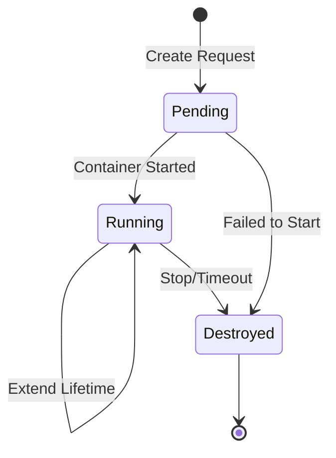

GZCTF supports container-based challenges using Docker or Kubernetes, providing isolated environments for each team with dynamic flag generation and resource management.

## Container Lifecycle

Container instances in GZCTF progress through several states:



### Container Status

<Tabs>
  <Tab title="Pending">
    **Container is being created**
    
    ```cs
    ContainerStatus.Pending = 0
    ```
    
    - Initial state when instance is requested
    - Platform is pulling image and starting container
    - Waiting for container to be ready
  </Tab>
  
  <Tab title="Running">
    **Container is active and accessible**
    
    ```cs
    ContainerStatus.Running = 1
    ```
    
    - Container successfully started
    - Accessible via entry point (IP:Port or proxy)
    - Resources allocated and monitored
  </Tab>
  
  <Tab title="Destroyed">
    **Container has been terminated**
    
    ```cs
    ContainerStatus.Destroyed = 2
    ```
    
    - Container stopped and cleaned up
    - Resources released
    - Cannot be restarted (create new instance)
  </Tab>
</Tabs>

## Container Properties

### Core Attributes

```cs
public class Container
{
    public Guid Id { get; set; }              // GZCTF internal ID
    public string ContainerId { get; set; }   // Docker/K8s container ID
    public string Image { get; set; }         // Docker image name:tag
    public ContainerStatus Status { get; set; }
    
    // Timing
    public DateTimeOffset StartedAt { get; set; }
    public DateTimeOffset ExpectStopAt { get; set; }
    
    // Networking
    public bool IsProxy { get; set; }         // Using reverse proxy?
    public string IP { get; set; }            // Local IP
    public int Port { get; set; }             // Local port
    public string? PublicIP { get; set; }     // Public IP (direct access)
    public int? PublicPort { get; set; }      // Public port (direct access)
}
```

### Entry Point

How users access the container depends on the network configuration:

```cs
public string Entry => IsProxy 
    ? Id.ToString()                    // Proxy: Use container ID
    : $"{PublicIP ?? IP}:{PublicPort ?? Port}";  // Direct: IP:Port
```

<Tabs>
  <Tab title="Reverse Proxy">
    **Traffic routed through GZCTF proxy**
    
    ```
    Entry: 3fa85f64-5717-4562-b3fc-2c963f66afa6
    Access: https://gzctf.example.com/api/proxy/3fa85f64-...
    ```
    
    Benefits:
    - No need to expose ports
    - Built-in traffic capture support
    - Better security and isolation
  </Tab>
  
  <Tab title="Direct Access">
    **Direct connection to container port**
    
    ```
    Entry: 192.168.1.100:10001
    Access: nc 192.168.1.100 10001
    ```
    
    Benefits:
    - Lower latency
    - Supports any protocol (not just HTTP)
    - Better for network challenges (SSH, nc, etc.)
  </Tab>
</Tabs>

## Orchestration Platforms

GZCTF supports two container orchestration platforms:

### Docker Provider

<Card title="Docker Engine" icon="docker">
  Recommended for single-server deployments and testing
</Card>

**Features:**
- Direct Docker API communication
- Simple setup and configuration
- Port mapping for direct access
- User-defined networks support

**Configuration:**
```yaml
Container:
  Manager: Docker
  PublicEntry: "your.server.ip"
  DockerConfig:
    SwarmMode: false
    Uri: unix:///var/run/docker.sock
```

### Kubernetes Provider

<Card title="Kubernetes" icon="dharmachakra">
  Recommended for production and multi-server deployments
</Card>

**Features:**
- Horizontal scaling across nodes
- Advanced resource management
- High availability
- Network policies and custom labels

**Configuration:**
```yaml
Container:
  Manager: Kubernetes
  PublicEntry: "k8s.cluster.domain"
  K8sConfig:
    Namespace: "gzctf-containers"
    ConfigPath: "/path/to/kubeconfig"
    AllowCIDR:
      - "10.0.0.0/8"
    DNS:
      - "8.8.8.8"
```

## Resource Limits

Each container challenge defines resource constraints:

| Resource | Property | Default | Description |
|----------|----------|---------|-------------|
| **Memory** | `MemoryLimit` | 64 MB | RAM allocation |
| **Storage** | `StorageLimit` | 256 MB | Disk space |
| **CPU** | `CPUCount` | 1 (0.1 CPU) | CPU cores in 0.1 units |
| **Port** | `ExposePort` | 80 | Container port to expose |

<Warning>
  CPU count is specified in **0.1 CPU units**:
  - `CPUCount = 1` → 0.1 CPUs
  - `CPUCount = 10` → 1.0 CPUs
  - `CPUCount = 20` → 2.0 CPUs
</Warning>

### Example Resource Configuration

```cs
var challenge = new Challenge
{
    Type = ChallengeType.DynamicContainer,
    ContainerImage = "myregistry/pwn-challenge:latest",
    MemoryLimit = 128,      // 128 MB RAM
    StorageLimit = 512,     // 512 MB disk
    CPUCount = 5,           // 0.5 CPU cores
    ExposePort = 9999       // Expose port 9999
};
```

## Network Modes

Containers can operate in different network isolation modes:

<Tabs>
  <Tab title="Open">
    **Full internet access**
    
    ```cs
    NetworkMode.Open = 0
    ```
    
    - Container can access external networks
    - Can download files from the internet
    - Suitable for challenges requiring external connectivity
  </Tab>
  
  <Tab title="Isolated">
    **No external network access**
    
    ```cs
    NetworkMode.Isolated = 32
    ```
    
    - Container cannot access external networks
    - Can only communicate within container internal network
    - Prevents data exfiltration
  </Tab>
  
  <Tab title="Custom">
    **User-defined network**
    
    ```cs
    NetworkMode.Custom = 255
    ```
    
    **Docker**: Uses user-defined Docker network specified in config
    
    **Kubernetes**: Adds label `gzctf.gzti.me/NetworkMode: custom`
  </Tab>
</Tabs>

## Instance Management

### Per-Team Limits

Games enforce concurrent container limits per team:

```cs
public int ContainerCountLimit { get; set; } = 3;
```

- Default: 3 simultaneous containers
- Teams must destroy instances to start new ones
- Prevents resource exhaustion

### Lifetime Management

<Steps>
  <Step title="Creation">
    Container starts when team activates a challenge:
    ```cs
    StartedAt = DateTimeOffset.UtcNow;
    ExpectStopAt = DateTimeOffset.UtcNow + TimeSpan.FromHours(2);
    ```
  </Step>
  
  <Step title="Extension">
    Teams can extend container lifetime (if permitted by platform config)
  </Step>
  
  <Step title="Destruction">
    Containers are destroyed when:
    - Team manually stops the instance
    - `ExpectStopAt` time is reached
    - Game ends (depends on practice mode)
    - Container limit is reached and new instance requested
  </Step>
</Steps>

<Note>
  The 2-hour default prevents immediate destruction after creation. Actual destruction time is managed by the container manager based on platform configuration.
</Note>

## Traffic Capture

GZCTF supports capturing network traffic for container instances:

```cs
public bool EnableTrafficCapture => 
    GameInstance?.Challenge.EnableTrafficCapture ?? false;
```

### Capture Storage

Traffic captures are stored with the following path structure:

```cs
public string TrafficPath(string conn) =>
    $"captures/{ChallengeId}/{ParticipationId}/{ShortId}-{conn}.pcap";
```

- `ChallengeId`: Identifies the challenge
- `ParticipationId`: Identifies the team
- `ShortId`: First 12 characters of container GUID
- `conn`: Connection identifier

**Example path:**
```
captures/42/1337/3fa85f645717-eth0.pcap
```

<Info>
  Traffic capture requires reverse proxy mode (`IsProxy = true`) and is only supported for web-based challenges.
</Info>

## Container Metadata

Containers can generate metadata for logging and tracking:

<Tabs>
  <Tab title="Game Instance">
    ```json
    {
      "Challenge": "Web Exploitation 101",
      "ChallengeId": 42,
      "Team": "TeamName",
      "TeamId": 1337,
      "ContainerId": "abc123def456",
      "Flag": "flag{dynamic_flag_here}"
    }
    ```
  </Tab>
  
  <Tab title="Exercise Instance">
    ```json
    {
      "Challenge": "Practice: Buffer Overflow",
      "ExerciseId": 10,
      "UserName": "john_doe",
      "UserId": "3fa85f64-5717-4562-b3fc-2c963f66afa6",
      "ContainerId": "xyz789abc123",
      "Flag": "flag{practice_flag}"
    }
    ```
  </Tab>
</Tabs>

## Container Instances

GZCTF distinguishes between two types of container instances:

### GameInstance

**Competition challenge containers**

```cs
public GameInstance? GameInstance { get; set; }
public int? GameInstanceId { get; set; }
```

- Associated with a game participation
- Counts toward team's container limit
- Subject to game timing constraints
- Tracked for scoring and events

### ExerciseInstance

**Practice/training containers**

```cs
public ExerciseInstance? ExerciseInstance { get; set; }
public int? ExerciseInstanceId { get; set; }
```

- Independent of games
- Personal practice environment
- Not subject to competition rules
- User-specific (not team-based)

## Container Model Reference

The Container model is located at:

```
~/workspace/source/src/GZCTF/Models/Data/Container.cs
```

<Accordion title="View Complete Container Model">
```cs
public class Container
{
    // Identity
    public Guid Id { get; set; }              // GZCTF GUID
    public string ContainerId { get; set; }   // Docker/K8s ID
    public string Image { get; set; }
    public ContainerStatus Status { get; set; }
    
    // Timing
    public DateTimeOffset StartedAt { get; set; }
    public DateTimeOffset ExpectStopAt { get; set; }
    
    // Networking
    public bool IsProxy { get; set; }
    public string IP { get; set; }
    public int Port { get; set; }
    public string? PublicIP { get; set; }
    public int? PublicPort { get; set; }
    
    // Computed properties
    public string Entry { get; }              // Access point
    public bool EnableTrafficCapture { get; }
    public string ShortId { get; }            // First 12 chars of GUID
    public string LogId { get; }              // For logging
    
    // Relationships
    public GameInstance? GameInstance { get; set; }
    public int? GameInstanceId { get; set; }
    public ExerciseInstance? ExerciseInstance { get; set; }
    public int? ExerciseInstanceId { get; set; }
    
    // Methods
    public string TrafficPath(string conn);
    public byte[]? GenerateMetadata(JsonSerializerOptions options);
}
```
</Accordion>

## Best Practices

<AccordionGroup>
  <Accordion title="Resource Allocation">
    - Set appropriate memory limits to prevent OOM kills
    - Use isolated network mode for pwn challenges
    - Limit CPU to prevent resource hogging
    - Monitor container counts per team
  </Accordion>
  
  <Accordion title="Image Management">
    - Use specific image tags (not `latest`)
    - Test containers before deploying to competition
    - Include flag placeholders in Dockerfile ENV
    - Minimize image size for faster startup
  </Accordion>
  
  <Accordion title="Security">
    - Use isolated network mode when possible
    - Set appropriate resource limits
    - Regularly update base images
    - Enable traffic capture for monitoring
  </Accordion>
  
  <Accordion title="Performance">
    - Pre-pull images before competition starts
    - Use local registry for faster pulls
    - Set appropriate `ExpectStopAt` times
    - Monitor container manager health
  </Accordion>
</AccordionGroup>

## Related Topics

<CardGroup cols={2}>
  <Card title="Challenges" icon="flag" href="/concepts/challenges">
    Configure container-based challenges
  </Card>
  <Card title="Dynamic Flags" icon="key" href="/advanced/dynamic-flags">
    Learn about flag generation in containers
  </Card>
  <Card title="Games" icon="trophy" href="/concepts/games">
    Manage container limits and game configuration
  </Card>
  <Card title="Teams" icon="users" href="/concepts/teams">
    Understand team instance management
  </Card>
</CardGroup>