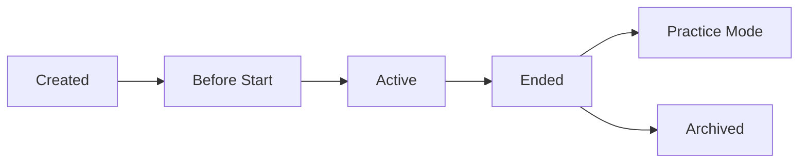

Games (also called competitions or events) are time-bound CTF competitions where teams compete to solve challenges and earn points.

## Game Lifecycle

A game in GZCTF progresses through several states:



### Game States

<Steps>
  <Step title="Before Start">
    Teams can register, but challenges are not accessible. Administrators can configure challenges and settings.
  </Step>
  
  <Step title="Active">
    The competition is live. Teams can access challenges, submit flags, and earn points. The game is considered active when:
    
    ```cs
    StartTimeUtc <= DateTimeOffset.Now && DateTimeOffset.Now <= EndTimeUtc
    ```
  </Step>
  
  <Step title="Ended">
    Competition time has expired. Depending on configuration:
    - **Practice Mode Enabled**: Teams can still solve challenges (no scoring/ranking changes)
    - **Practice Mode Disabled**: Challenges become inaccessible
  </Step>
  
  <Step title="Writeup Submission">
    If writeups are required, teams must submit before the writeup deadline.
  </Step>
</Steps>

## Game Configuration

### Basic Information

| Property | Description |
|----------|-------------|
| **Title** | Game name displayed to participants |
| **Summary** | Brief description shown in game listings |
| **Content** | Detailed introduction with rules and information |
| **PosterHash** | Game poster image |
| **Hidden** | Hide game from public listings |

### Timing

All times use UTC with `DateTimeOffset` for timezone accuracy.

<CodeGroup>
```cs Game Timing
public DateTimeOffset StartTimeUtc { get; set; }
public DateTimeOffset EndTimeUtc { get; set; }
public DateTimeOffset WriteupDeadline { get; set; }
```

```cs Check if Active
public bool IsActive => 
    StartTimeUtc <= DateTimeOffset.Now && 
    DateTimeOffset.Now <= EndTimeUtc;
```
</CodeGroup>

### Participation Settings

**Team Registration**

<Tabs>
  <Tab title="Open Registration">
    ```cs
    AcceptWithoutReview = true
    ```
    Teams are automatically accepted when they register.
  </Tab>
  
  <Tab title="Review Required">
    ```cs
    AcceptWithoutReview = false
    ```
    Administrators must manually approve team registrations.
  </Tab>
  
  <Tab title="Invite Only">
    ```cs
    InviteCode = "secret-code-2024"
    ```
    Teams must provide the invite code to register.
  </Tab>
</Tabs>

**Team Constraints**

```cs
// Limit team size (0 = no limit)
public int TeamMemberCountLimit { get; set; }

// Limit simultaneous containers per team
public int ContainerCountLimit { get; set; } = 3;
```

### Writeup Configuration

<Info>
  Writeups are post-competition technical reports where teams explain their solutions.
</Info>

```cs
public bool WriteupRequired { get; set; }
public DateTimeOffset WriteupDeadline { get; set; }
public string WriteupNote { get; set; } // Instructions for participants
```

When `WriteupRequired` is true:
- Teams must submit writeups before the deadline
- Writeups can be reviewed and downloaded by administrators
- Teams without writeups may have different participation status

## Scoring Configuration

### Blood Bonuses

The first three teams to solve each challenge receive bonus points:

```cs
public BloodBonus BloodBonus { get; set; }

// Default values:
// First blood:  +50% (1.5x multiplier)
// Second blood: +30% (1.3x multiplier)
// Third blood:  +10% (1.1x multiplier)
```

<Note>
  Blood bonus percentages are stored as integers (parts per thousand) for precision:
  - 50 = 5.0% bonus
  - 300 = 30.0% bonus
  - 500 = 50.0% bonus
</Note>

The blood bonus is encoded as a single `long` value:

```cs
BloodBonusValue = (FirstBlood << 20) + (SecondBlood << 10) + ThirdBlood
DefaultValue = (50 << 20) + (30 << 10) + 10  // 50%, 30%, 10%
```

### Dynamic Scoring

See [Scoring](/concepts/scoring) for detailed information about the dynamic scoring formula.

## Security Features

### Team Tokens

Each team participation generates a unique signed token:

```cs
public string PublicKey { get; set; }  // Ed25519 public key
public string PrivateKey { get; set; } // Ed25519 private key (encrypted)
```

Tokens are used for:
- Dynamic flag generation
- Team-specific challenge instances
- Preventing flag sharing detection

### Team Hash Salt

A game-specific salt ensures flag uniqueness:

```cs
public string TeamHashSalt => $"GZCTF@{PrivateKey}@PK".ToSHA256String();
```

## Practice Mode

<Warning>
  Practice mode allows most operations to continue after the game ends, but rankings and scoring are frozen.
</Warning>

```cs
public bool PracticeMode { get; set; } = true;
```

When enabled:
- Challenges remain accessible after `EndTimeUtc`
- Teams can still solve challenges
- Scores and rankings are not updated
- New teams cannot join
- Useful for learning and practicing

## Divisions

Games can be divided into separate divisions (tracks) for different participant groups:

```cs
public HashSet<Division>? Divisions { get; set; }
```

Divisions allow:
- Separate scoreboards per division
- Different challenge visibility per division
- Division-specific permissions and invite codes

See [Teams](/concepts/teams#divisions) for more details.

## Game Model Reference

The Game model is located at:

```
~/workspace/source/src/GZCTF/Models/Data/Game.cs
```

<Accordion title="View Game Model Structure">
```cs
public partial class Game
{
    public int Id { get; set; }
    public string Title { get; set; }
    public string Summary { get; set; }
    public string Content { get; set; }
    public string? PosterHash { get; set; }
    public bool Hidden { get; set; }
    
    // Timing
    public DateTimeOffset StartTimeUtc { get; set; }
    public DateTimeOffset EndTimeUtc { get; set; }
    public DateTimeOffset WriteupDeadline { get; set; }
    
    // Configuration
    public bool PracticeMode { get; set; } = true;
    public bool AcceptWithoutReview { get; set; }
    public bool WriteupRequired { get; set; }
    public string? InviteCode { get; set; }
    public int TeamMemberCountLimit { get; set; }
    public int ContainerCountLimit { get; set; } = 3;
    
    // Scoring
    public BloodBonus BloodBonus { get; set; }
    
    // Security
    public string PublicKey { get; set; }
    public string PrivateKey { get; set; }
    
    // Relationships
    public HashSet<GameChallenge> Challenges { get; set; }
    public HashSet<Participation> Participations { get; set; }
    public HashSet<Team>? Teams { get; set; }
    public HashSet<Division>? Divisions { get; set; }
    public List<GameEvent> GameEvents { get; set; }
    public List<GameNotice> GameNotices { get; set; }
    public List<Submission> Submissions { get; set; }
}
```
</Accordion>

## Related Topics

<CardGroup cols={2}>
  <Card title="Challenges" icon="flag" href="/concepts/challenges">
    Learn about challenge types and configuration
  </Card>
  <Card title="Teams & Participation" icon="users" href="/concepts/teams">
    Understand how teams join and participate
  </Card>
  <Card title="Scoring System" icon="chart-line" href="/concepts/scoring">
    Explore dynamic scoring and blood bonuses
  </Card>
  <Card title="Containers" icon="docker" href="/concepts/containers">
    Manage container-based challenges
  </Card>
</CardGroup>