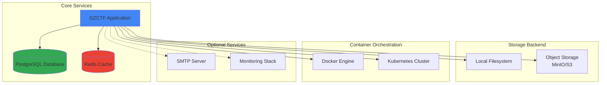

# Installation Guide

This guide will walk you through deploying your own GZCTF instance. GZCTF is designed to be deployed using containers for optimal portability and scalability.

<Warning>
  **Important**: Before upgrading or migrating:
  1. Database migrations run automatically on startup
  2. Downgrade operations are NOT supported
  3. Always backup your data before upgrading
  4. Large version jumps may cause data incompatibility
  5. Review release notes for breaking changes
</Warning>

## System Requirements

### Minimum Requirements

<CardGroup cols={2}>
  <Card title="CPU" icon="microchip">
    2 cores (x64 or ARM64 architecture)
  </Card>
  
  <Card title="Memory" icon="memory">
    4 GB RAM minimum
    
    8 GB+ recommended for production
  </Card>
  
  <Card title="Storage" icon="hard-drive">
    20 GB minimum
    
    Scales with challenges and logs
  </Card>
  
  <Card title="Network" icon="network-wired">
    Stable internet connection
    
    Public IP for external access
  </Card>
</CardGroup>

### Production Requirements

For production deployments with significant load:

- **CPU**: 8+ cores for handling concurrent container operations
- **Memory**: 16GB+ RAM (GZCTF tested with 16c90g handling 1.34M requests in 3 minutes)
- **Storage**: SSD recommended for database performance
- **Network**: Low latency, high bandwidth for container traffic

### Software Prerequisites

<Tabs>
  <Tab title="Docker Deployment">
    - Docker Engine 20.10+
    - Docker Compose V2 (recommended)
    - PostgreSQL 12+ (can be containerized)
    - Redis 6+ (can be containerized)
  </Tab>
  
  <Tab title="Kubernetes Deployment">
    - Kubernetes 1.20+
    - kubectl configured
    - Helm 3+ (optional but recommended)
    - PostgreSQL 12+
    - Redis 6+
  </Tab>
</Tabs>

## Architecture Overview

A typical GZCTF deployment consists of:



## Docker Deployment

The recommended deployment method uses Docker containers for all services.

<Steps>
  <Step title="Install Docker">
    If you don't have Docker installed:
    
    <CodeGroup>
    ```bash Ubuntu/Debian
    # Update package index
    sudo apt-get update
    
    # Install dependencies
    sudo apt-get install -y apt-transport-https ca-certificates curl gnupg lsb-release
    
    # Add Docker's official GPG key
    curl -fsSL https://download.docker.com/linux/ubuntu/gpg | sudo gpg --dearmor -o /usr/share/keyrings/docker-archive-keyring.gpg
    
    # Set up stable repository
    echo "deb [arch=$(dpkg --print-architecture) signed-by=/usr/share/keyrings/docker-archive-keyring.gpg] https://download.docker.com/linux/ubuntu $(lsb_release -cs) stable" | sudo tee /etc/apt/sources.list.d/docker.list > /dev/null
    
    # Install Docker Engine
    sudo apt-get update
    sudo apt-get install -y docker-ce docker-ce-cli containerd.io docker-compose-plugin
    
    # Verify installation
    sudo docker --version
    ```
    
    ```bash CentOS/RHEL
    # Install required packages
    sudo yum install -y yum-utils
    
    # Add Docker repository
    sudo yum-config-manager --add-repo https://download.docker.com/linux/centos/docker-ce.repo
    
    # Install Docker Engine
    sudo yum install -y docker-ce docker-ce-cli containerd.io docker-compose-plugin
    
    # Start Docker
    sudo systemctl start docker
    sudo systemctl enable docker
    
    # Verify installation
    sudo docker --version
    ```
    </CodeGroup>
  </Step>
  
  <Step title="Create Project Directory">
    Create a directory structure for your GZCTF deployment:
    
    ```bash
    mkdir -p ~/gzctf/{data,logs,files}
    cd ~/gzctf
    ```
    
    Directory purposes:
    - `data/`: PostgreSQL database files
    - `logs/`: Application logs
    - `files/`: Challenge files and uploads (if not using object storage)
  </Step>
  
  <Step title="Create Docker Compose File">
    Create a `docker-compose.yml` file with the following configuration:
    
    ```yaml docker-compose.yml
    version: '3.8'
    
    services:
      gzctf:
        image: gztime/gzctf:latest
        container_name: gzctf
        restart: always
        ports:
          - "80:8080"  # HTTP port
        environment:
          # Database Configuration
          - CONNECTIONSTRINGS__DATABASE=Host=db:5432;Database=gzctf;Username=postgres;Password=<your-db-password>
          
          # Redis Configuration
          - CONNECTIONSTRINGS__REDIS=cache:6379,password=<your-redis-password>
          
          # Email Configuration (Optional)
          - EMAILCONFIG__SENDMAILADDRESS=noreply@example.com
          - EMAILCONFIG__SMTP__HOST=smtp.example.com
          - EMAILCONFIG__SMTP__PORT=587
          - EMAILCONFIG__SMTP__CREDENTIALS__USERNAME=<smtp-username>
          - EMAILCONFIG__SMTP__CREDENTIALS__PASSWORD=<smtp-password>
          
          # Container Provider (docker or kubernetes)
          - CONTAINERPROVIDER__TYPE=docker
          - CONTAINERPROVIDER__PUBLICENTRY=<your-public-ip-or-domain>
          
          # Storage Configuration
          - STORAGE__TYPE=local  # or minio, s3
          
          # Misc Settings
          - ASPNETCORE_URLS=http://0.0.0.0:8080
          - LOGGING__LOGLEVEL__DEFAULT=Information
        volumes:
          - ./files:/app/files
          - ./logs:/app/log
          - /var/run/docker.sock:/var/run/docker.sock  # For Docker container management
        depends_on:
          - db
          - cache
        networks:
          - gzctf-network
      
      db:
        image: postgres:16-alpine
        container_name: gzctf-db
        restart: always
        environment:
          - POSTGRES_PASSWORD=<your-db-password>
          - POSTGRES_USER=postgres
          - POSTGRES_DB=gzctf
        volumes:
          - ./data/postgres:/var/lib/postgresql/data
        networks:
          - gzctf-network
      
      cache:
        image: redis:7-alpine
        container_name: gzctf-cache
        restart: always
        command: redis-server --requirepass <your-redis-password>
        volumes:
          - ./data/redis:/data
        networks:
          - gzctf-network
    
    networks:
      gzctf-network:
        driver: bridge
    ```
    
    <Warning>
      **Security**: Replace all `<your-*-password>` placeholders with strong, unique passwords. Never commit these files with real credentials to version control.
    </Warning>
  </Step>
  
  <Step title="Configure Environment Variables">
    For better security, create a `.env` file instead of hardcoding passwords:
    
    ```bash .env
    # Database
    POSTGRES_PASSWORD=your_secure_db_password_here
    
    # Redis
    REDIS_PASSWORD=your_secure_redis_password_here
    
    # SMTP (if using email)
    SMTP_USERNAME=your_smtp_username
    SMTP_PASSWORD=your_smtp_password
    
    # Public Entry
    PUBLIC_ENTRY=your.domain.com
    ```
    
    Then reference in docker-compose.yml using `${VARIABLE_NAME}` syntax.
  </Step>
  
  <Step title="Start Services">
    Launch all services:
    
    ```bash
    # Pull latest images
    docker compose pull
    
    # Start services in detached mode
    docker compose up -d
    
    # View logs
    docker compose logs -f gzctf
    ```
    
    <Info>
      First startup may take 1-2 minutes as the database is initialized and migrations are applied.
    </Info>
  </Step>
  
  <Step title="Verify Installation">
    Check that all services are running:
    
    ```bash
    # Check container status
    docker compose ps
    
    # Expected output:
    # NAME         IMAGE                  STATUS
    # gzctf        gztime/gzctf:latest   Up
    # gzctf-db     postgres:16-alpine    Up
    # gzctf-cache  redis:7-alpine        Up
    
    # Test health endpoint
    curl http://localhost/healthz
    ```
    
    Navigate to `http://localhost` (or your server IP) in a browser. You should see the GZCTF interface.
  </Step>
</Steps>

## Understanding the Dockerfile

GZCTF uses a multi-stage build optimized for Alpine Linux:

```dockerfile Dockerfile
FROM mcr.microsoft.com/dotnet/aspnet:10.0-alpine AS build
ARG TARGETPLATFORM
COPY publish /build
RUN cp -r /build/${TARGETPLATFORM} /publish

FROM mcr.microsoft.com/dotnet/aspnet:10.0-alpine AS final

# Globalization support for multi-language
ENV DOTNET_SYSTEM_GLOBALIZATION_INVARIANT=false \
    LC_ALL=en_US.UTF-8

WORKDIR /app

# Install runtime dependencies
RUN apk add --update --no-cache \
    wget \
    libpcap \
    icu-data-full \
    icu-libs \
    ca-certificates \
    libgdiplus \
    tzdata \
    krb5-libs && \
    update-ca-certificates

COPY --from=build --chown=$APP_UID:$APP_UID /publish .

# Expose application port
EXPOSE 8080

# Health check configuration
HEALTHCHECK --interval=5m --timeout=3s --start-period=10s --retries=1 \
    CMD wget --no-verbose --tries=1 --spider http://localhost:3000/healthz || exit 1

ENTRYPOINT ["dotnet", "GZCTF.dll"]
```

**Key features:**
- Based on .NET 10.0 Alpine for minimal size
- Multi-platform support (x64, ARM64)
- Includes ICU for internationalization
- Health check endpoint at `/healthz`
- Runs on port 8080 internally

## First-Time Configuration

After installation, configure your GZCTF instance:

<Steps>
  <Step title="Access Admin Panel">
    1. Navigate to your GZCTF URL
    2. Click "Register" and create the first user account
    3. The first registered user is automatically granted admin privileges
  </Step>
  
  <Step title="Configure Global Settings">
    Navigate to **Admin Panel → Settings** and configure:
    
    <AccordionGroup>
      <Accordion title="Basic Information">
        - **Platform Title**: Your CTF platform name
        - **Platform Description**: Brief description for SEO
        - **Platform Logo/Favicon**: Upload custom branding
        - **Footer Content**: Custom footer HTML
      </Accordion>
      
      <Accordion title="Account Policies">
        - **Allow Registration**: Enable/disable public registration
        - **Email Confirmation**: Require email verification
        - **Active on Register**: Auto-activate accounts
        - **Email Domain List**: Restrict to specific domains
        - **Use Captcha**: Enable Cloudflare Turnstile
      </Accordion>
      
      <Accordion title="Container Configuration">
        - **Provider Type**: Docker or Kubernetes
        - **Public Entry**: Your public IP or domain
        - **Port Range**: Range for dynamic container ports
        - **Registry**: Container image registry URL
        - **Auto Destroy**: Container lifetime settings
      </Accordion>
      
      <Accordion title="Storage Configuration">
        - **Storage Type**: Local, MinIO, or S3
        - **Bucket Name**: For object storage
        - **Access Key/Secret**: Object storage credentials
        - **Region**: For AWS S3
      </Accordion>
    </AccordionGroup>
  </Step>
  
  <Step title="Test Configuration">
    - Send a test email to verify SMTP settings
    - Create a test challenge with container to verify orchestration
    - Upload a test file to verify storage backend
    - Check health metrics and logs
  </Step>
</Steps>

## Advanced Configuration

### Using Object Storage (MinIO/S3)

For scalable deployments, use object storage instead of local files:

<CodeGroup>
```yaml MinIO Configuration
environment:
  - STORAGE__TYPE=minio
  - STORAGE__MINIO__ENDPOINT=minio:9000
  - STORAGE__MINIO__ACCESSKEY=minioadmin
  - STORAGE__MINIO__SECRETKEY=minioadmin
  - STORAGE__MINIO__SECURE=false
  - STORAGE__MINIO__BUCKETNAME=gzctf
```

```yaml AWS S3 Configuration
environment:
  - STORAGE__TYPE=s3
  - STORAGE__S3__REGION=us-east-1
  - STORAGE__S3__ACCESSKEY=${AWS_ACCESS_KEY_ID}
  - STORAGE__S3__SECRETKEY=${AWS_SECRET_ACCESS_KEY}
  - STORAGE__S3__BUCKETNAME=gzctf-challenges
```
</CodeGroup>

### Kubernetes Deployment

For Kubernetes deployments:

1. Configure container provider: `CONTAINERPROVIDER__TYPE=kubernetes`
2. Create appropriate RBAC roles for pod management
3. Use Kubernetes secrets for sensitive configuration
4. Configure persistent volumes for database
5. Set up ingress for external access

<Note>
  Detailed Kubernetes manifests and Helm charts are available in the official documentation.
</Note>

### Reverse Proxy Setup

For production, use a reverse proxy (nginx, Caddy, Traefik):

<CodeGroup>
```nginx nginx.conf
server {
    listen 80;
    server_name ctf.example.com;
    
    # Redirect HTTP to HTTPS
    return 301 https://$server_name$request_uri;
}

server {
    listen 443 ssl http2;
    server_name ctf.example.com;
    
    ssl_certificate /etc/ssl/certs/cert.pem;
    ssl_certificate_key /etc/ssl/private/key.pem;
    
    client_max_body_size 256M;
    
    location / {
        proxy_pass http://localhost:8080;
        proxy_http_version 1.1;
        proxy_set_header Upgrade $http_upgrade;
        proxy_set_header Connection "upgrade";
        proxy_set_header Host $host;
        proxy_set_header X-Real-IP $remote_addr;
        proxy_set_header X-Forwarded-For $proxy_add_x_forwarded_for;
        proxy_set_header X-Forwarded-Proto $scheme;
    }
}
```

```caddyfile Caddyfile
ctf.example.com {
    reverse_proxy localhost:8080
    
    encode gzip
    
    header {
        # Security headers
        Strict-Transport-Security "max-age=31536000;"
        X-Content-Type-Options "nosniff"
        X-Frame-Options "SAMEORIGIN"
        Referrer-Policy "no-referrer-when-downgrade"
    }
}
```
</CodeGroup>

## Monitoring & Maintenance

### Health Checks

GZCTF exposes health endpoints:

```bash
# Basic health check
curl http://localhost:8080/healthz

# Detailed health information (admin only)
curl http://localhost:8080/api/health
```

### Viewing Logs

<CodeGroup>
```bash Docker Logs
# Follow application logs
docker compose logs -f gzctf

# View specific time range
docker compose logs --since 30m gzctf

# Save logs to file
docker compose logs gzctf > logs.txt
```

```bash File Logs
# Application logs location
tail -f ~/gzctf/logs/gzctf-*.log

# Search for errors
grep -i "error\|exception" ~/gzctf/logs/*.log
```
</CodeGroup>

### Backup Strategy

<Warning>
  Regular backups are CRITICAL. GZCTF does not support downgrades, and data loss can be unrecoverable.
</Warning>

<Steps>
  <Step title="Database Backup">
    ```bash
    # Automated PostgreSQL backup
    docker exec gzctf-db pg_dump -U postgres gzctf > backup_$(date +%Y%m%d).sql
    
    # Restore from backup
    docker exec -i gzctf-db psql -U postgres gzctf < backup_20260301.sql
    ```
  </Step>
  
  <Step title="Files Backup">
    ```bash
    # Backup files directory
    tar -czf files_backup_$(date +%Y%m%d).tar.gz -C ~/gzctf files/
    
    # Restore files
    tar -xzf files_backup_20260301.tar.gz -C ~/gzctf
    ```
  </Step>
  
  <Step title="Configuration Backup">
    ```bash
    # Backup entire configuration
    tar -czf gzctf_full_backup_$(date +%Y%m%d).tar.gz \
      ~/gzctf/docker-compose.yml \
      ~/gzctf/.env \
      ~/gzctf/data/ \
      ~/gzctf/files/
    ```
  </Step>
</Steps>

### Upgrading GZCTF

<Steps>
  <Step title="Backup Everything">
    Create a complete backup before upgrading (see Backup Strategy above).
  </Step>
  
  <Step title="Pull Latest Image">
    ```bash
    cd ~/gzctf
    docker compose pull gzctf
    ```
  </Step>
  
  <Step title="Restart Services">
    ```bash
    docker compose up -d gzctf
    ```
    
    Database migrations run automatically on startup.
  </Step>
  
  <Step title="Verify Upgrade">
    ```bash
    # Check logs for successful migration
    docker compose logs gzctf | grep -i migration
    
    # Verify application is running
    curl http://localhost/healthz
    ```
  </Step>
</Steps>

## Troubleshooting

<AccordionGroup>
  <Accordion title="Cannot Connect to Database">
    **Symptoms**: Application fails to start, connection refused errors
    
    **Solutions**:
    - Verify PostgreSQL container is running: `docker compose ps`
    - Check database password matches in both services
    - Ensure network connectivity: `docker compose exec gzctf ping db`
    - Review PostgreSQL logs: `docker compose logs db`
  </Accordion>
  
  <Accordion title="Container Challenges Won't Start">
    **Symptoms**: "Failed to create container" errors
    
    **Solutions**:
    - Verify Docker socket is mounted: `-v /var/run/docker.sock:/var/run/docker.sock`
    - Check Docker permissions: GZCTF needs access to Docker API
    - Verify network configuration and port ranges
    - Check available system resources (CPU, memory, disk)
    - Review container provider settings in admin panel
  </Accordion>
  
  <Accordion title="Email Verification Not Working">
    **Symptoms**: Users don't receive verification emails
    
    **Solutions**:
    - Test SMTP settings from admin panel
    - Check SMTP credentials are correct
    - Verify firewall allows outbound SMTP traffic
    - Check spam folders
    - Review email logs: `docker compose logs gzctf | grep -i email`
  </Accordion>
  
  <Accordion title="High Memory Usage">
    **Symptoms**: System slowness, OOM errors
    
    **Solutions**:
    - Limit Redis memory: add `maxmemory 2gb` to Redis config
    - Configure container auto-destroy to clean up unused instances
    - Increase system resources
    - Monitor with `docker stats`
    - Check for memory leaks in logs
  </Accordion>
  
  <Accordion title="Slow Database Queries">
    **Symptoms**: Slow page loads, timeouts
    
    **Solutions**:
    - Ensure PostgreSQL has adequate resources
    - Check database indexes are created (automatic)
    - Monitor query performance: `docker exec gzctf-db psql -U postgres -d gzctf -c "SELECT * FROM pg_stat_statements ORDER BY total_exec_time DESC LIMIT 10;"`
    - Consider increasing PostgreSQL shared_buffers
    - Use SSD storage for database
  </Accordion>
</AccordionGroup>

## Performance Tuning

For high-load scenarios:

<Tabs>
  <Tab title="Database Optimization">
    Add to PostgreSQL configuration:
    
    ```ini
    shared_buffers = 2GB
    effective_cache_size = 6GB
    maintenance_work_mem = 512MB
    checkpoint_completion_target = 0.9
    wal_buffers = 16MB
    default_statistics_target = 100
    random_page_cost = 1.1
    effective_io_concurrency = 200
    work_mem = 20MB
    min_wal_size = 1GB
    max_wal_size = 4GB
    ```
  </Tab>
  
  <Tab title="Redis Optimization">
    Add to Redis configuration:
    
    ```ini
    maxmemory 4gb
    maxmemory-policy allkeys-lru
    save ""
    appendonly no
    ```
  </Tab>
  
  <Tab title="Application Tuning">
    Add environment variables:
    
    ```yaml
    - ASPNETCORE_THREADPOOL_MINWORKER=100
    - ASPNETCORE_THREADPOOL_MAXWORKER=200
    - ASPNETCORE_KESTREL__LIMITS__MAXREQUESTBODYSIZE=268435456
    ```
  </Tab>
</Tabs>

## Security Best Practices

<CardGroup cols={2}>
  <Card title="Network Security" icon="shield">
    - Use HTTPS with valid certificates
    - Configure firewall rules
    - Limit database access to localhost
    - Use VPN for admin access
  </Card>
  
  <Card title="Access Control" icon="lock">
    - Strong passwords for all services
    - Regular password rotation
    - Enable 2FA for admin accounts (if available)
    - Audit user permissions regularly
  </Card>
  
  <Card title="Data Protection" icon="database">
    - Encrypt database backups
    - Secure backup storage
    - Regular backup testing
    - GDPR compliance for user data
  </Card>
  
  <Card title="Container Security" icon="docker">
    - Keep images updated
    - Scan for vulnerabilities
    - Limit container resources
    - Use security profiles
  </Card>
</CardGroup>

## Next Steps

<CardGroup cols={2}>
  <Card title="Admin Guide" icon="user-shield" href="/admin/creating-games">
    Learn how to configure and manage your GZCTF platform.
  </Card>
  
  <Card title="Create Your First Game" icon="flag" href="/admin/creating-games">
    Set up your first CTF competition.
  </Card>
  
  <Card title="Challenge Configuration" icon="puzzle-piece" href="/admin/challenge-management">
    Create and configure challenges for your competitions.
  </Card>
  
  <Card title="Monitoring & Metrics" icon="chart-line" href="/admin/monitoring">
    Set up monitoring and observability for your instance.
  </Card>
</CardGroup>

## Community & Support

Need help with installation?

- [GitHub Issues](https://github.com/GZTimeWalker/GZCTF/issues)
- [Telegram Group](https://telegram.dog/gzctf)
- [Discord Server](https://discord.gg/dV9A6ZjVhC)
- [Official Documentation](https://gzctf.gzti.me/)
