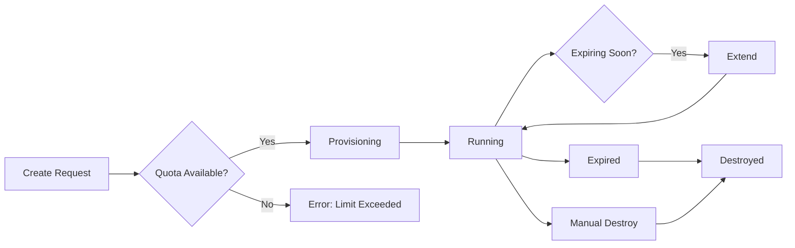

## Overview

GZCTF games are time-bound CTF competitions where teams solve challenges to earn points. This guide covers the complete participation workflow from joining a game to submitting flags.

## Joining a Game

<Steps>
  <Step title="Browse Available Games">
    View recent and upcoming games:
    
    ```http
    GET /api/Game/Recent?limit=10
    GET /api/Game?count=10&skip=0
    ```
    
    Games show status indicators:
    - **Upcoming**: Registration open, game not started
    - **Active**: Game in progress
    - **Ended**: Game completed (practice mode may be available)
  </Step>
  
  <Step title="Select Your Team">
    Choose which team you want to represent in the game.
    
    <Note>
      You must be a member of a team to participate. Create or join a team first if needed.
    </Note>
  </Step>
  
  <Step title="Check Join Requirements">
    Verify you meet the requirements:
    
    ```http
    GET /api/Game/{gameId}/Check
    ```
    
    Requirements may include:
    - **Division Selection**: Choose your competition division (if applicable)
    - **Invitation Code**: Enter game/division invitation code (if required)
    - **Team Member Limit**: Ensure your team doesn't exceed the limit
    - **Not Already Registered**: You can't join with multiple teams
  </Step>
  
  <Step title="Join the Game">
    Submit your join request:
    
    ```json
    POST /api/Game/{gameId}
    {
      "teamId": 123,
      "divisionId": 5,        // Optional, required if divisions exist
      "inviteCode": "abc123"  // Optional, if game/division requires it
    }
    ```
    
    <Tabs>
      <Tab title="Auto-Accepted">
        If the game has `AcceptWithoutReview` enabled:
        
        ```
        ✓ Successfully joined [Game Name] with team [Team Name]
        ```
        
        You can immediately start competing.
      </Tab>
      
      <Tab title="Pending Review">
        If admin review is required:
        
        ```
        ✓ Join request submitted - Awaiting approval
        ```
        
        Wait for an administrator to approve your participation.
      </Tab>
    </Tabs>
  </Step>
</Steps>

<Warning>
  - You cannot join a game after it has ended (unless practice mode is enabled)
  - You can only join with ONE team per game
  - You cannot change divisions after joining
</Warning>

## Viewing Challenges

Once your participation is accepted:

```http
GET /api/Game/{gameId}/Details
```

Returns:
- **Challenges**: All available challenges grouped by category
- **Team Token**: Your unique team authentication token
- **Scoreboard Position**: Your team's current rank and score
- **Writeup Requirements**: Whether writeups are required after the game

### Challenge Information

Each challenge includes:
- **Title & Description**: Challenge details
- **Category**: Web, Pwn, Reverse, Crypto, Misc, etc.
- **Difficulty**: Points value (may be dynamic)
- **Solved Count**: Number of teams that solved it
- **Blood Bonus**: Extra points for first/second/third solves

## Solving Challenges

### Static Challenges

For challenges without dynamic containers:

<Steps>
  <Step title="Read Challenge">
    Get full challenge details:
    
    ```http
    GET /api/Game/{gameId}/Challenges/{challengeId}
    ```
    
    Review:
    - Challenge description
    - Downloadable files
    - Hints (if available)
    - Connection information (if applicable)
  </Step>
  
  <Step title="Solve Challenge">
    Work on the challenge using your CTF skills.
  </Step>
  
  <Step title="Submit Flag">
    Submit your answer:
    
    ```json
    POST /api/Game/{gameId}/Challenges/{challengeId}
    {
      "flag": "flag{your_answer_here}"
    }
    ```
    
    <Info>
      Flags are encrypted during transmission. The server decrypts and validates them.
    </Info>
  </Step>
  
  <Step title="Check Result">
    Poll for submission status:
    
    ```http
    GET /api/Game/{gameId}/Challenges/{challengeId}/Status/{submissionId}
    ```
    
    Possible results:
    - ✓ **Accepted**: Correct flag! Points awarded.
    - ✗ **Wrong Answer**: Incorrect flag, try again.
    - ⚠ **Cheat Detected**: Flag from another team (shown as wrong answer to you).
  </Step>
</Steps>

### Dynamic Container Challenges

For challenges requiring dedicated instances:

<Steps>
  <Step title="Create Container">
    Launch your personal instance:
    
    ```http
    POST /api/Game/{gameId}/Container/{challengeId}
    ```
    
    Response includes:
    ```json
    {
      "containerId": "abc123",
      "status": "Running",
      "ip": "10.0.0.1",
      "port": 8080,
      "entry": "http://10.0.0.1:8080",
      "expectStopAt": "2024-03-01T15:30:00Z"
    }
    ```
    
    <Warning>
      Games have a container count limit (typically 1-3 per team). You cannot exceed this limit.
    </Warning>
  </Step>
  
  <Step title="Access Container">
    Connect to your instance using the provided entry point:
    - **HTTP**: Open the URL in your browser
    - **TCP**: Use `nc`, `telnet`, or custom clients
    - **SSH**: Use SSH client with provided credentials
  </Step>
  
  <Step title="Extend Lifetime (Optional)">
    Containers automatically expire after a configured time (e.g., 2 hours). 
    
    Extend within the renewal window (e.g., last 10 minutes):
    
    ```http
    POST /api/Game/{gameId}/Container/{challengeId}/Extend
    ```
    
    <Info>
      Extension adds additional time (e.g., +2 hours) to prevent interruption during active solving.
    </Info>
  </Step>
  
  <Step title="Solve & Submit">
    Work on the challenge and submit flags as described above.
  </Step>
  
  <Step title="Destroy Container (Optional)">
    Clean up when done:
    
    ```http
    DELETE /api/Game/{gameId}/Container/{challengeId}
    ```
    
    <Note>
      Containers auto-destroy on expiration. Manual destruction frees up your container quota.
    </Note>
  </Step>
</Steps>

## Container Instance Lifecycle



### Container States

- **Provisioning**: Container being created
- **Running**: Active and accessible
- **Expired**: Lifetime ended, will be destroyed
- **Destroyed**: Removed from cluster

### Rate Limiting

Container operations are rate-limited to prevent abuse:

- **Too Frequent**: Wait between create/destroy operations
- **429 Error**: "Operation too frequent, please try again later"

<Warning>
  Avoid rapidly creating and destroying containers. This wastes resources and may trigger rate limits.
</Warning>

## Submission Limits

Challenges may have submission limits:

- **Unlimited**: Submit as many times as needed
- **Limited** (e.g., 10 attempts): Restricted attempts per challenge

```
✗ Submission limit exceeded for this challenge
```

<Info>
  Check the challenge details for the current submission count and limit.
</Info>

## Leaving a Game

You can leave a game under certain conditions:

```http
DELETE /api/Game/{gameId}
```

<Warning>
  - You can only leave if your participation status is **Pending** or **Rejected**
  - You cannot leave after being **Accepted** (prevents gaming the system)
  - When you leave, you're removed from the team's participation
</Warning>

## Practice Mode

After a game ends, practice mode may be available:

- **Access**: Join/rejoin ended games
- **Features**:
  - All challenges available
  - Flag submission works
  - Scoreboards frozen (no rank changes)
  - Writeup submission may still be required

<Note>
  Practice mode allows learning and training without competitive pressure.
</Note>

## Common Issues

### "Game has ended"

**Solution**: You cannot join ended games unless practice mode is enabled.

### "You are not a member of this team"

**Solution**: Join the team before trying to register for games.

### "You are already in this game with another team"

**Solution**: You can only participate with one team. Leave the other team's participation first (if still pending).

### "Container limit exceeded"

**Solution**: Destroy existing containers before creating new ones.

### "Extension not available"

**Solution**: Extensions only work within the renewal window (e.g., last 10 minutes before expiry).

### "Challenge not found"

**Causes**:
- Challenge was disabled
- Your division doesn't have permission to view it
- Challenge ID is incorrect

## API Reference

See GameController.cs for complete implementation:

- `POST /api/Game/{id}` - Join game (GameController.cs:153-281)
- `GET /api/Game/{id}/Details` - Get challenges (GameController.cs:715-784)
- `POST /api/Game/{id}/Challenges/{challengeId}` - Submit flag (GameController.cs:951-1056)
- `POST /api/Game/{id}/Container/{challengeId}` - Create container (GameController.cs:1188-1254)
- `POST /api/Game/{id}/Container/{challengeId}/Extend` - Extend lifetime (GameController.cs:1256-1304)
- `DELETE /api/Game/{id}/Container/{challengeId}` - Destroy container (GameController.cs:1306-1374)